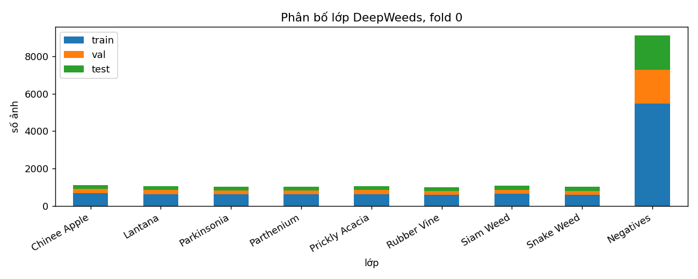
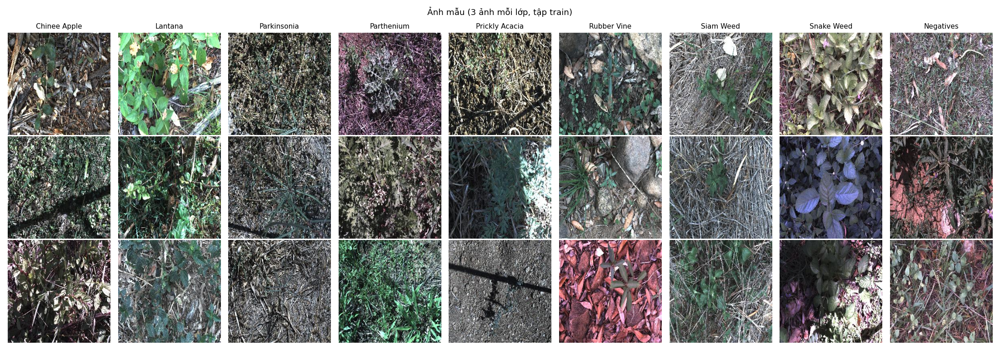
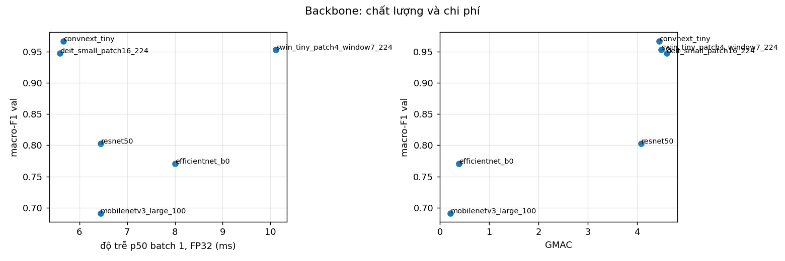
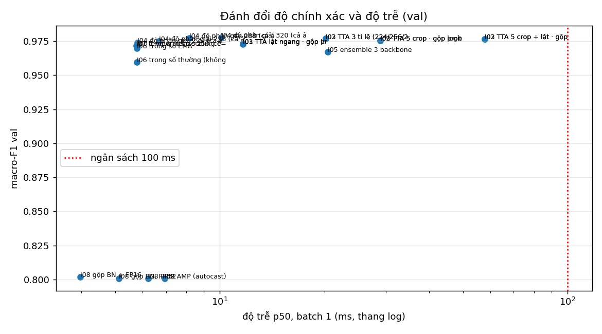
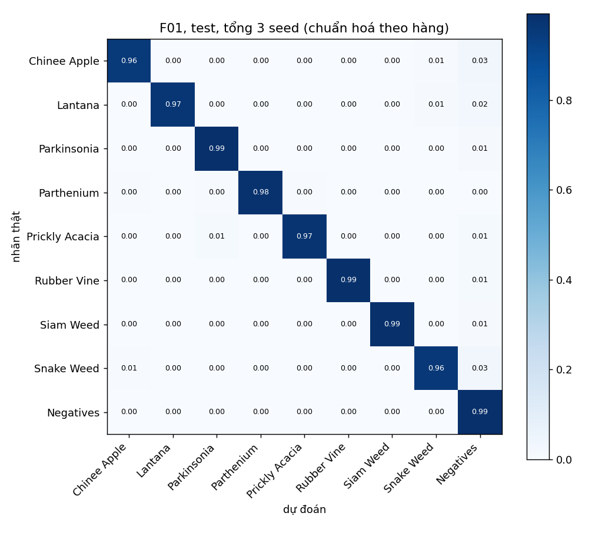
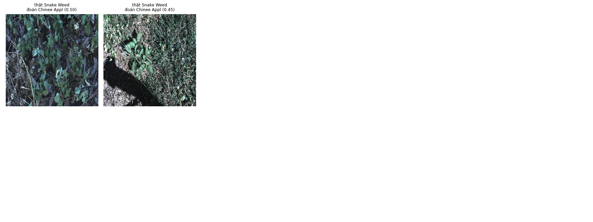

# Báo cáo Lab Day 2: Backbone, công thức huấn luyện và suy luận trên DeepWeeds

Lê Anh Duy · Kaggle, GPU Tesla T4 · torch 2.11.0+cu128, timm 1.0.29 · mọi số liệu lấy từ `results.xlsx` và `eval_out_copy/` (tính bằng `eval.py` gốc).

## 1. Tóm tắt

- **Bài toán:** phân loại ảnh DeepWeeds thành 9 lớp, dùng fold 0 chia sẵn của tác giả. Chỉ số chính là macro-F1.
- **Đã làm:** 6 backbone (B01–B06), 10 ablation công thức huấn luyện cộng 1 tổ hợp (T01–T11), 9 nhóm phương pháp suy luận (I00–I08), chung kết 3 seed.
- **Cấu hình tốt nhất (F01):**
  - Backbone: ConvNeXt-Tiny (`convnext_tiny.in12k_ft_in1k`).
  - Huấn luyện: công thức nền + TrivialAugmentWide + label smoothing 0,1 + EMA 0,998.
  - Suy luận: TTA 3 tỉ lệ (224/256/288), gộp logit, temperature scaling khớp trên val.
- **Kết quả test (mean ± std, 3 seed):**
  - **macro-F1 0,9807 ± 0,0018**, top-1 0,9840 ± 0,0012, ECE 0,0039.
  - Mốc `T00`+`I00` đạt 0,9693 ± 0,0028, nên Δ = **+0,0114**, lớn hơn std lớn nhất (0,0028).
  - Recall Chinee Apple / Snake Weed = 95,7% / 95,9%, cao hơn mốc của bài báo (88,5% / 88,8%).
- **Kết luận chính:**
  - Chọn backbone quyết định nhiều nhất: macro-F1 val trải từ 0,691 đến 0,967.
  - Công thức huấn luyện và suy luận mỗi thứ chỉ thêm khoảng +0,004 đến +0,006 macro-F1 val, nhưng cộng lại thành cải thiện rõ trên test.
  - Độ trễ của F01 là p95 23,3 ms ở batch 1, nằm trong ngân sách 100 ms.

## 2. Dữ liệu và thiết lập

**Chia dữ liệu (fold 0, file CSV nguyên bản, không sửa).** `dataset.check_split` chạy trước mọi lần train:

| Lớp | train | val | test | tổng | Table 1 bài báo |
|---|---|---|---|---|---|
| Chinee Apple | 675 | 225 | 226 | 1126 | 1125 |
| Lantana | 637 | 213 | 213 | 1063 | 1064 |
| Parkinsonia | 618 | 206 | 207 | 1031 | 1031 |
| Parthenium | 613 | 204 | 205 | 1022 | 1022 |
| Prickly Acacia | 637 | 212 | 213 | 1062 | 1062 |
| Rubber Vine | 605 | 202 | 202 | 1009 | 1009 |
| Siam Weed | 644 | 215 | 215 | 1074 | 1074 |
| Snake Weed | 609 | 203 | 204 | 1016 | 1016 |
| Negatives | 5463 | 1821 | 1822 | 9106 | 9106 |
| **Tổng** | **10.501** | **3.501** | **3.507** | **17.509** | 17.509 |

- **Tỉ lệ chia:** 59,98 / 20,00 / 20,03%.
- **Giao giữa các tập:** train∩val = train∩test = val∩test = 0; hợp ba tập đủ 17.509 ảnh; không thiếu file ảnh nào.
- **Lệch so với bài báo:** số đếm lệch Table 1 một ảnh ở hai lớp (Chinee Apple +1, Lantana −1), tổng vẫn khớp. Có thể là một ảnh được gán nhãn khác giữa bài báo và file `labels.csv`; tôi giữ nguyên CSV.
- **Mất cân bằng:** `Negatives` chiếm 52%, nên top-1 bị lớp này kéo cao. Vì vậy mọi lựa chọn đều dựa trên macro-F1.

**Kiểm tra pipeline (GUIDE mục 1.3):**
- Loss ban đầu của head mới khoảng 2,2, xấp xỉ ln 9 = 2,197. Overfit một batch 16 ảnh: loss giảm từ khoảng 2,2 xuống khoảng 0,004 sau 80 bước (`figures/overfit_one_batch.png`).
- Ảnh sau augmentation và CutMix được vẽ cùng nhãn để kiểm tra ảnh khớp nhãn (`figures/aug_preview.png`).
- Unit test tự viết (`code/test_code.py`): focal γ=0 ≡ CE, label smoothing ε=0 ≡ CE, λ của CutMix bằng diện tích thật, gộp Conv+BN sai số < 1e-4, temperature tìm lại đúng T, warmup + cosine.

**Công thức nền `T00`:**
- Khởi tạo: trọng số ImageNet, head mới 9 lớp, tinh chỉnh toàn bộ.
- Dữ liệu: train `RandomResizedCrop(224)` + lật ngang; val/test resize 256 rồi center crop 224.
- Tối ưu: AdamW, LR backbone 1e-4 / head 1e-3; weight decay 0,05, không áp lên norm/bias/pos_embed; warmup 1 epoch rồi cosine theo từng bước.
- Còn lại: CE, batch 64, 12 epoch, AMP. Checkpoint là epoch có macro-F1 val cao nhất.

**Seed và mức tái lập:**
- Bước 1–3 dùng seed 0; `T00` và F01 chạy 3 seed (0, 1, 2).
- `cudnn.benchmark=True` nên hai lần chạy cùng seed có thể lệch rất nhỏ.

**Tái sử dụng run:** `T00` seed 0 trùng cấu hình với `B02`, F01 seed 0 trùng với `T11` seed 0, nên dùng lại run cũ thay vì train lại (`note` trong sheet `Training`).

**Quy tắc val/test:**
- Mọi lựa chọn (backbone, tổ hợp T11, phương pháp suy luận, nhiệt độ T) đều làm trên val.
- Test chỉ chạy một lần cho mỗi seed, ở Bước 4. Code từ chối chạy lại nếu file test đã tồn tại.

## 3. So sánh backbone (sheet `Backbones`)

| exp_id | backbone (tag) | params (M) | GMAC | macro-F1 val | top-1 val | s/epoch | p50 batch 1 (ms) |
|---|---|---|---|---|---|---|---|
| B01 | resnet50.a1_in1k | 23,5 | 4,09 | 0,8026 | 0,8566 | 34 | 6,4 |
| **B02** | **convnext_tiny.in12k_ft_in1k** | 27,8 | 4,45 | **0,9670** | **0,9740** | 52 | 5,7 |
| B03 | deit_small_patch16_224.fb_in1k | 21,7 | 4,60 | 0,9473 | 0,9609 | 34 | 5,6 |
| B04 | swin_tiny_patch4_window7_224.ms_in1k | 27,5 | 4,49 | 0,9533 | 0,9657 | 65 | 10,1 |
| B05 | efficientnet_b0.ra_in1k | 4,0 | 0,38 | 0,7704 | 0,8292 | 29 | 8,0 |
| B06 | mobilenetv3_large_100.ra_in1k | 4,2 | 0,22 | 0,6914 | 0,7761 | 18 | 6,4 |

**Nhận xét:**
- **Khoảng cách giữa các backbone rất lớn.** Ba mạng dùng LayerNorm (ConvNeXt, DeiT, Swin) đạt 0,947–0,967. Ba mạng dùng BatchNorm (ResNet-50, EfficientNet-B0, MobileNetV3) chỉ đạt 0,69–0,80.
  - Đường cong của B01 (`curves/B01_resnet50.png`) cho thấy loss train và val vẫn đi sát nhau (khoảng 0,38–0,43), F1 val đi ngang từ epoch 8. Đây là **thiếu khớp, không phải quá khớp**.
  - **Giả thuyết** (chưa kiểm chứng): công thức nền (LR backbone 1e-4, 12 epoch) quá nhẹ cho các bộ trọng số `a1`/`ra` vốn được huấn luyện bằng công thức rất khác; mạng BN có thể cần LR cao hơn hoặc nhiều epoch hơn.
  - Như vậy, thứ hạng ở đây phản ánh **backbone kết hợp với công thức nền này**, không phải thứ hạng tuyệt đối của kiến trúc. Thứ hạng cũng khác ImageNet: ResNet-50 a1 trên ImageNet ngang ConvNeXt-T, nhưng ở đây thua xa.
- **Trọng số tiền huấn luyện cũng khác nhau:** ConvNeXt dùng bản tiền huấn luyện trên ImageNet-22k (`in12k_ft_in1k`), các mạng còn lại chỉ dùng ImageNet-1k. Đây có thể là một phần lý do ConvNeXt dẫn đầu, nên so sánh chưa hoàn toàn "cùng điều kiện".
- **FLOPs không dự đoán được độ trễ:** MobileNetV3 chỉ 0,22 GMAC nhưng ở batch 1 chậm hơn ConvNeXt-T (4,45 GMAC): 6,4 ms so với 5,7 ms. Ở batch 1 trên GPU, thời gian bị chi phối bởi số lần gọi kernel chứ không bởi FLOPs. Swin chậm nhất (10,1 ms), có thể do attention cửa sổ có nhiều thao tác reshape.
- **Chọn ConvNeXt-Tiny để đi tiếp:**
  - Macro-F1 val cao nhất, hơn Swin 0,014 và DeiT 0,020.
  - Đồng thời có độ trễ batch 1 thuộc nhóm thấp nhất.
  - Không có đánh đổi nào buộc phải chọn mạng khác.

## 4. Công thức huấn luyện (sheet `Training`, backbone ConvNeXt-Tiny, seed 0)

**Mức nhiễu:**
- `T00` qua 3 seed đạt macro-F1 val 0,9676 ± 0,0005. Trên test, std của `T00` là 0,0028.
- Mỗi ablation chỉ có một seed, nên tôi coi **|Δ| < khoảng 0,003 là không phân biệt được**, dù cột "vượt nhiễu" của xlsx (so với std val 0,0005) đánh dấu nhiều dòng là True.

| exp_id | trục | khác T00 | macro-F1 val | Δ | đánh giá |
|---|---|---|---|---|---|
| T00 | – | nền | 0,9670 | 0 | |
| T01 | A | huấn luyện từ đầu | 0,3117 | −0,655 | kém rõ rệt |
| T02 | A | đóng băng backbone | 0,8491 | −0,118 | kém rõ rệt |
| T03 | B | + ColorJitter | 0,9659 | −0,001 | không phân biệt được |
| **T04** | B | **+ TrivialAugmentWide** | **0,9714** | **+0,004** | tốt nhất, hơi vượt nhiễu |
| T05 | B | + CutMix | 0,9667 | −0,000 | không phân biệt được |
| T06 | C | label smoothing 0,1 | 0,9680 | +0,001 | không phân biệt được |
| T07 | C | focal γ=2 | 0,9676 | +0,001 | không phân biệt được |
| T08 | C | CE trọng số 1/n_c | 0,9669 | −0,000 | không phân biệt được |
| T09 | D | sampler cân bằng | 0,9664 | −0,001 | không phân biệt được |
| **T10** | F | **EMA 0,998** | **0,9697** | **+0,003** | biên nhiễu |
| T11 | kết hợp | T04 + T06 + T10 | 0,9714 | +0,004 | bằng T04, **không cộng dồn** |

**Nhận xét:**
- **Khởi tạo quan trọng nhất trong các trục.**
  - Train từ đầu với 10,5k ảnh và 12 epoch chỉ đạt 0,31 (top-1 0,55, gần mức đoán toàn `Negatives`).
  - Đóng băng backbone chỉ đạt 0,85: đặc trưng ImageNet chưa đủ cho ảnh cỏ dại, phải tinh chỉnh toàn bộ.
- **Augmentation:** TrivialAugmentWide giúp ít nhưng nhất quán. ColorJitter và CutMix không giúp ở 12 epoch; CutMix thường cần lịch dài hơn mới có lợi.
- **Loss và sampler cho dữ liệu mất cân bằng:** label smoothing, focal, CE có trọng số và sampler cân bằng đều nằm trong nhiễu. Có thể vì 8 lớp cỏ có số ảnh gần bằng nhau, và với ConvNeXt mất cân bằng 52% không làm hại macro-F1 nhiều. F1 của các lớp hiếm cũng không tăng rõ.
- **EMA:** trên cùng run T10, trọng số EMA đạt 0,9697 còn trọng số thường ở cùng epoch chỉ 0,9594 (sheet `Inference`, I06). EMA được lợi "miễn phí" khoảng 0,01 so với trọng số thường của chính nó.
- **Kết hợp (T11):**
  - Cách chọn tự động: mỗi trục lấy giá trị tốt nhất có Δ > std của T00.
  - Kết quả 0,9714, bằng T04 đứng một mình: các hiệu ứng **không cộng dồn**.
  - T11 vẫn được giữ cho chung kết vì có macro-F1 val cao nhất (0,97142, sát T04 0,97137); hai giá trị này thực chất không phân biệt được.
  - Cách làm là *tham lam theo trục*: mỗi ablation chỉ so với T00, chọn theo một seed. Thứ tự và nhiễu có thể ảnh hưởng tới lựa chọn.
- **Đường cong** (`curves/T*.png`): epoch tốt nhất của đa số run T là 11–12 (cột `best_epoch`), nên 12 epoch có lẽ còn thiếu. Với B02/T00 (`curves/B02_convnext_tiny.png`), loss val đi ngang khoảng 0,10 trong khi loss train tiếp tục giảm, nên chỉ có dấu hiệu quá khớp nhẹ.

## 5. Suy luận (sheet `Inference`, model T11 seed 0, trên val)

| exp_id | phương pháp | K | macro-F1 val | ECE val | p50 / p95 (ms, batch 1) | chi phí so với I00 |
|---|---|---|---|---|---|---|
| I00 | 1 view (resize 256, crop 224) | 1 | 0,9714 | 0,085 | 5,8 / 6,1 | 1,0× |
| I01 | TTA lật ngang | 2 | 0,9732 | 0,087 | 11,7 / 16,9 | 2,0× |
| I02 | TTA 5 crop | 5 | 0,9755 | 0,088 | 28,9 / 29,6 | 5,0× |
| I02 | TTA 5 crop + lật | 10 | 0,9765 | 0,088 | 57,8 / 58,9 | 10,0× |
| I02/I03 | TTA 3 tỉ lệ, gộp prob / logit | 3 | 0,9769 / 0,9770 | 0,101 / 0,098 | 20,2 / 20,8 | 3,5× |
| I04 | độ phân giải 224 / 256 / 288 / 320 (cả ảnh) | 1 | 0,9737 / 0,9749 / 0,9773 / **0,9775** | 0,08–0,12 | 5,8 / 6,7 / 8,2 / 10,1 | 1,0–1,7× |
| I05 | ensemble B02+B04+B03 | 3 | 0,9670 | 0,012 | 20,4 / 22,5 | 3,5× |
| I06 | EMA (T10) / trọng số thường | 1 | 0,9697 / 0,9594 | 0,007 | 5,8 | 1,0× |
| I07 | temperature scaling T = 0,616 | 1 | 0,9714 | **0,005** (trước: 0,085) | 5,7 | 1,0× |
| I08 | ResNet-50: FP32 / gộp BN / AMP / gộp BN + FP16 | 1 | 0,8006 / 0,8006 / 0,8006 / 0,8020 | 0,010–0,011 | 6,2 / 5,1 / 6,9 / 4,0 | 1,07× / 0,88× / 1,20× / 0,69× |

**Nhận xét:**
- **TTA:** mọi kiểu TTA đều tăng macro-F1, từ +0,002 (lật) đến +0,006 (3 tỉ lệ), và chi phí tăng gần đúng K lần (5 crop: 5,0×; 10 view: 10,0×). Gộp prob hay gộp logit cho kết quả gần như nhau (chênh ≤ 0,0003): không phân biệt được.
- **Dò độ phân giải (FixRes):** chạy một lượt ở 288–320 tốt ngang TTA 3 tỉ lệ (0,9773–0,9775) mà chỉ tốn 1,4–1,7×. Đây là lựa chọn **hiệu quả nhất về chi phí**.
  - Quy tắc chọn trong notebook chỉ xét I00–I03, nên chung kết dùng TTA 3 tỉ lệ thay vì I04 ở 320. Chênh lệch 0,0005 nằm trong nhiễu, nhưng I04 rẻ hơn khoảng 2 lần. Nếu làm lại, tôi sẽ chọn I04 ở 288 hoặc 320.
- **Ensemble 3 backbone:** không hơn ConvNeXt đứng một mình (0,9670 so với 0,9670), vì hai thành viên còn lại yếu hơn. Đổi lại, ensemble hiệu chuẩn tốt hơn nhiều (ECE 0,012).
- **Temperature scaling:**
  - T = 0,616 < 1, nghĩa là T11 **thiếu tự tin**. Điều này phù hợp với label smoothing cộng EMA, vốn làm xác suất "mềm" hơn.
  - ECE val giảm từ 0,085 xuống 0,005; accuracy không đổi.
  - Đây là con số trên chính tập val dùng để khớp T nên lạc quan; con số trên test ở mục 6.
- **Gộp BN và FP16 (đo trên ResNet-50, vì ConvNeXt dùng LayerNorm, không có BN để gộp):**
  - Gộp Conv+BN không làm đổi kết quả (F1 giữ nguyên 0,8006) mà giảm độ trễ từ 6,2 xuống 5,1 ms.
  - Gộp BN kết hợp FP16 còn 4,0 ms.
  - **AMP ở batch 1 chậm hơn FP32** với cả ConvNeXt (7,8 so với 5,9 ms) và ResNet-50 (6,9 so với 6,1 ms), khớp với slide. Ở batch 32 thì AMP và FP16 nhanh hơn FP32 khoảng 2,8–3,5 lần (sheet `Latency`).
- **Ngoại tuyến hay thời gian thực:** dữ liệu ủng hộ kết luận của slide.
  - TTA nhiều view và ensemble chỉ đáng dùng ngoại tuyến.
  - Trên robot nên dùng các cách không tốn thêm hoặc tốn ít: EMA, temperature scaling, gộp BN, FP16, độ phân giải đã dò.

## 6. Cấu hình tốt nhất và kết quả test (sheet `Final`, `PerClass`)

**F01:**
- Backbone: `convnext_tiny.in12k_ft_in1k`.
- Huấn luyện: công thức nền + TrivialAugmentWide + label smoothing 0,1 + EMA 0,998, 12 epoch.
- Suy luận: TTA 3 tỉ lệ (224/256/288) gộp logit, rồi temperature scaling khớp T trên val của từng seed.
- Đây là cấu hình T11, nên seed 0 dùng lại run T11; seed 1 và 2 được train mới.

| Cấu hình | seed | macro-F1 val | macro-F1 test | top-1 test | balanced acc test | ECE test |
|---|---|---|---|---|---|---|
| F01 | 0 / 1 / 2 | 0,9770 / 0,9773 / 0,9800 | 0,9797 / 0,9827 / 0,9796 | 0,9832 / 0,9855 / 0,9835 | | 0,0034 / 0,0029 / 0,0054 |
| **F01** | **mean ± std** | 0,9781 ± 0,0017 | **0,9807 ± 0,0018** | **0,9840 ± 0,0012** | 0,9772 ± 0,0024 | **0,0039 ± 0,0014** |
| T00 + I00 (mốc) | mean ± std | 0,9676 ± 0,0005 | 0,9693 ± 0,0028 | 0,9760 ± 0,0016 | 0,9724 ± 0,0046 | 0,0099 ± 0,0011 |

- **Cải thiện so với mốc:** Δ macro-F1 test = +0,0114 > s = 0,0028, vậy là **vượt nhiễu**. Top-1 tăng 0,8 điểm %, NLL giảm từ 0,081 xuống 0,059.
- **Hiệu chuẩn:** F01 khi chưa temperature scaling (`F01uncal`) có ECE test 0,0997 ± 0,0025; sau khi áp dụng T đã khớp trên val, ECE còn 0,0039. Hiệu chuẩn chuyển được từ val sang test.
- **Chênh val/test:** 0,9781 so với 0,9807, chênh 0,0026 ≤ 0,02. Không có dấu hiệu chọn cấu hình bị quá khớp vào val.
- **So với bài báo** (chỉ để tham khảo):
  - Top-1 test 98,4% cao hơn ResNet-50 của bài báo (95,7%) và Inception-v3 (95,1%).
  - Nhưng bài báo báo cáo "weighted average accuracy" trung bình qua 5 fold, còn đây là một fold.
  - Hai số liệu trên là **trích dẫn từ bài báo**, không phải kết quả của tôi.

**F1 từng lớp trên test (mean qua 3 seed):**

| Lớp | Chinee | Lantana | Parkinsonia | Parthenium | Prickly | Rubber | Siam | Snake | Negatives |
|---|---|---|---|---|---|---|---|---|---|
| F01 | 0,967 | 0,979 | 0,983 | 0,992 | 0,970 | 0,987 | 0,990 | 0,969 | 0,988 |
| T00 | 0,947 | 0,975 | 0,979 | 0,979 | 0,947 | 0,984 | 0,980 | 0,948 | 0,984 |

Recall hai lớp khó: Chinee Apple 95,7% (T00: 93,8%), Snake Weed 95,9% (T00: 94,9%).

**Phân tích lỗi (ma trận nhầm lẫn cộng dồn 3 seed, `eval_out_copy/*_confusion_sum.csv`):**
- **Cặp Chinee Apple ↔ Snake Weed:** giảm mạnh so với mốc. Chinee→Snake từ 20 xuống 5 ảnh; Snake→Chinee từ 10 xuống 4.
- **Lỗi lớn nhất còn lại là cỏ bị đoán thành `Negatives`:** Chinee 23, Snake 20, Lantana 15 (cộng dồn 3 seed). Chiều ngược lại, `Negatives` bị đoán thành Prickly Acacia 18 lần (mốc: 36).
  - **Giả thuyết:** ảnh `Negatives` là thực vật khác chụp ở cùng địa điểm, nên khi cây mục tiêu nhỏ, bị che hoặc nằm ở rìa ảnh, model nghiêng về lớp đa số. Center crop 224 có thể cắt mất phần cây ở rìa; TTA đa tỉ lệ nhìn cả ảnh nên giúp được một phần.
- **Ảnh nhầm Chinee↔Snake** (`figures/errors_chinee_snake.png`): seed 0 chỉ còn 2 ảnh, đều là Snake Weed bị đoán thành Chinee Apple với độ tin cậy thấp (0,50 và 0,45).
  - Một ảnh có bóng người che gần nửa khung hình; ảnh còn lại tối, lá nhỏ lẫn trong nền lá khô.
  - **Giả thuyết:** điều kiện ánh sáng (bóng đổ, thiếu sáng) và tán lá chồng lấn là nguồn lỗi chính. Lá của hai loài nhìn gần giống nhau ở độ phân giải 224.

**Cấu hình thời gian thực (I5):**
- F01 với TTA 3 tỉ lệ, FP32, batch 1 trên T4: p50 khoảng 20 ms (I02 ở mục 5), **p95 23,3 ms** ≤ 100 ms (`grade_I.json`). Đo đúng cách: warmup 10 lần, `cuda.synchronize`, 100 lần đo, không tính tiền xử lý.
- Nếu ngân sách chặt hơn: một lượt ở 288 chỉ mất khoảng 8 ms mà macro-F1 val tương đương.

## 7. Kết luận và khuyến nghị

- **Cấu hình tốt nhất:** F01 như trên, đạt macro-F1 test 0,9807 ± 0,0018. Hơn mốc +0,0114, vượt nhiễu (std 0,0028).
- **Yếu tố đóng góp nhiều nhất:**
  - **Backbone**, cùng với khởi tạo tiền huấn luyện và tinh chỉnh toàn bộ: chênh tới 0,28 macro-F1 val giữa các backbone; train từ đầu mất 0,66.
  - Công thức huấn luyện (+0,004) và suy luận (+0,006) nhỏ hơn nhiều. Riêng lẻ thì nằm sát biên nhiễu, nhưng cộng lại vẫn cho cải thiện rõ trên test.
- **Triển khai trên robot (ngân sách 30–100 ms mỗi khung):**
  - Dùng ConvNeXt-Tiny với trọng số EMA, chạy một lượt ở độ phân giải 288 (khoảng 8 ms trên T4).
  - Thêm temperature scaling để ngưỡng tin cậy có ý nghĩa.
  - FP16 nếu phần cứng hỗ trợ, nhưng phải đo lại ở batch 1 vì AMP có thể chậm hơn.
  - TTA 3 tỉ lệ (khoảng 20 ms) vẫn vừa ngân sách nếu GPU tương đương T4. Trên Jetson thì phải đo lại; bài báo báo cáo ResNet-50 mất 53–180 ms trên TX2.

## 8. Hạn chế và việc tiếp theo

- **Một fold, chia ngẫu nhiên** (không theo địa điểm): ảnh cùng địa điểm và cùng thời điểm có thể nằm ở cả train lẫn test, nên điểm test **có thể lạc quan** so với khi gặp địa điểm hay mùa mới. Đây là rủi ro lệch phân phối lớn nhất khi triển khai.
- **Số seed:** ablation ở Bước 2 và 3 chỉ có 1 seed; chỉ T00 và F01 có 3 seed. Std của T00 trên val (0,0005) nhỏ hơn nhiều so với trên test (0,0028), nên các Δ cỡ 0,001–0,003 ở Bước 2 không kết luận được.
- **Ngân sách GPU:** 12 epoch (bài báo dùng khoảng 100 epoch). Nhiều run vẫn còn tăng ở epoch cuối.
  - Các mạng BN (ResNet-50, EfficientNet, MobileNet) thua có thể do công thức nền không hợp với chúng, chưa chắc do kiến trúc.
  - Chưa thử trục E (LR/optimizer) và trục G (độ phân giải train, số epoch), là hai trục có thể giải thích điều này.
- **Quy tắc chọn phương pháp suy luận** chỉ xét I00–I03, nên bỏ qua I04 ở 320 dù I04 rẻ hơn mà tương đương.
- **ViT/Swin** không chạy được TTA đa tỉ lệ hay dò độ phân giải vì timm cố định đầu vào 224. Phần này không ảnh hưởng chung kết vì backbone được chọn là ConvNeXt.
- **Việc tiếp theo:**
  - Thử LR cao hơn và nhiều epoch hơn cho các mạng BN.
  - Chạy nhiều fold.
  - Đánh giá trên ảnh bị làm tối hoặc có bóng đổ, vì lỗi Chinee/Snake liên quan tới ánh sáng.
  - Thử Grad-CAM trên các ảnh cỏ bị đoán thành `Negatives`.

## 9. Phụ lục

- **Cấu hình đầy đủ của mọi run:** `runs/<exp_id>/seed<k>/config.json` (lưu trên Kaggle output, không commit vì có checkpoint); các cột cấu hình chính nằm trong `results.xlsx`.
- **Danh sách exp_id:**
  - Backbone: B01 resnet50, B02 convnext_tiny, B03 deit_small, B04 swin_tiny, B05 efficientnet_b0, B06 mobilenetv3.
  - Huấn luyện: T00–T11 như bảng mục 4.
  - Suy luận: I00–I08 như bảng mục 5.
  - Chung kết: F01 (3 seed) và mốc T00 (3 seed).
- **Biểu đồ training:** `curves/<exp_id>_<mô tả>.png` cho mọi run B, T, F, mỗi seed một ảnh.
- **Dự đoán test:** `predictions/F01_seed{0,1,2}_test.csv`, `F01uncal_seed*_test.csv`, `F01_seed*_val.csv`, `T00_seed*_test.csv`. Tự chấm phần I: `eval_out_copy/grade_I.json`.
- **Notebook:** `code/lab_day2.ipynb` (chạy trên Kaggle, GPU T4). Phiên bản thư viện: `requirements-colab.txt`.
